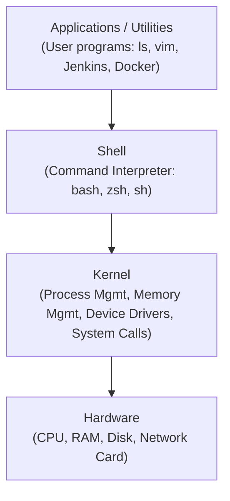

# Batch 18 — Linux Running Notes: 13 August 2026

**Topic: Cloud vs On-Premises, Why Linux, AWS Free Tier**

Friends, before touching a single Linux command, we first need to understand *why* we are even learning Linux in a DevOps course. Today's class was pure theory — no typing on the terminal — but this theory is the foundation for everything we do after this. Understand this properly once, and the rest of the course will make a lot more sense.

---

## 1. On-Premises vs Cloud — what is the actual difference?

**On-premises** simply means: you own and manage everything yourself, in your own datacenter. That includes the servers (big computers), storage, networking equipment, power supply, cooling systems, security, and IT staff to maintain all of it.

**Cloud** means: you are using someone else's computers (servers) over the internet, instead of owning and managing your own.

**Real-time example — setting up a new Jenkins CI/CD server:**

On-premises way:
- Raise a hardware purchase request to procurement
- Wait days/weeks for the physical server to arrive
- Rack it in the datacenter, install the OS, set up networking
- Handle power, cooling, and hardware failures yourself
- Buy a bigger server when your builds/team grow
- If the hardware fails → risk of downtime and data loss

Result: takes time, high cost, requires a dedicated infra team.

Cloud way:
- Log in to AWS console
- Launch an EC2 instance (choose size/type)
- Pay per hour or usage
- Scale up (bigger instance) or add more instances anytime, based on load

Result: fast, flexible, and exactly why almost every DevOps job today expects hands-on AWS/Azure/GCP experience — this is our day 1 in this course.

---

## 2. Key benefits of Cloud (why it's so popular)

- No hardware to buy
- Pay only for what you use (on-demand)
- Easy to scale resources up or down
- High availability
- High scalability
- Faster to start
- Global access from anywhere

## 3. When is on-premises still used?

Some companies still prefer on-premises when:
- Strict data security laws exist (banking, government, defence)
- Internet is not reliable in their location
- Legacy systems are in use, which are hard to move
- Full control over systems is required

**Real-time example:** In your DevOps career, you may work on a project where the client is a bank or an insurance company, and their compliance/security team mandates that certain workloads must run in an on-premises datacenter or a private cloud, not public AWS/Azure — even though public cloud is cheaper and faster to set up. This is a very common real constraint you'll hear in client requirement discussions, not just an exam topic.

---

## 4. Why Linux? Why not Windows?

**Simple answer:** Cloud runs mostly on Linux, not Windows.

Why Linux?
- Free (open source)
- Stable — runs for years without needing a restart
- Lightweight
- Secure & reliable
- Highly customizable
- Perfect for servers

Why not Windows (for servers)?
- Windows is mainly designed for desktop users
- Heavier OS (uses more resources)
- Paid license
- Less suitable for large-scale servers

**Linux vs Windows:**

| Feature | Linux | Windows |
|---|---|---|
| Cost | Free (open-source) | Paid license |
| Performance | Fast & lightweight | Heavy |
| Stability | Runs for years | Needs restarts |
| Security | Very secure | More virus-prone |
| Automation | Excellent (CLI-based) | Limited |
| Server usage | Very high | Less |
| Cloud support | Default choice | Secondary |

**Real-time example:** As a DevOps engineer, close to 100% of the servers you'll actually SSH into for your job — EC2 instances, Jenkins build servers, Docker hosts, Kubernetes worker nodes — will be running Linux. You will rarely, if ever, need to RDP into a Windows server in a typical DevOps role. This is exactly why every DevOps job description lists "strong Linux command-line skills" as a core requirement, right alongside AWS and Jenkins.

---

## 5. UNIX vs Linux — where did Linux come from?

**UNIX (the original):**
- Old operating system, created in the 1970s
- Expensive, proprietary
- Mostly used in big enterprises
- Examples: AIX, Solaris, HP-UX

**Linux (inspired by UNIX):**
- Open-source and free
- Created in 1991 by Linus Torvalds
- Community-driven — thousands of developers contribute to it
- Runs everywhere: cloud, mobile, servers

| UNIX | Linux |
|---|---|
| Proprietary | Open-source |
| Paid | Free |
| Limited vendors | Huge community |
| Less flexible | Highly customizable |
| Legacy systems | Used everywhere today |

**Real-time example:** You'll almost never touch a raw UNIX box in your DevOps career — but you'll live inside RHEL, Ubuntu, or Amazon Linux servers every single day, and those are the direct descendants of this same UNIX lineage. Knowing this history helps when you read documentation that says "POSIX-compliant" or "UNIX-like" — it means the same core commands (`ls`, `cd`, `grep`, permissions model) will work the same way, whether it's an old enterprise AIX box or a brand-new EC2 instance.

### Few important facts to remember

- Android (your mobile phone OS) is based on Linux
- AWS runs mostly on Linux
- Google runs on Linux
- Facebook runs on Linux
- Around 90% of internet servers run Linux
- Linux is the backbone of Cloud

### Major Linux distribution families

- **RHEL** (Red Hat Enterprise Linux) — used heavily in enterprises
- **Ubuntu** — very popular, beginner-friendly
- **Amazon Linux** — AWS's own distribution, optimized for EC2
- **Debian** — stable, community-driven, Ubuntu is actually built on top of Debian

**Real-time example:** On a real project, you'll notice a company usually standardizes on **one** distro across their entire server fleet — say, all EC2 instances on Amazon Linux, or all on-prem servers on RHEL. That's not a random choice: mixing distros means your Ansible playbooks, package manager commands (`yum` on RHEL/Amazon Linux vs `apt` on Ubuntu/Debian), patching schedules, and security hardening steps all differ per distro — doubling the maintenance work for the DevOps team. Interviewers often ask "which distro have you worked with" for exactly this reason.

### Linux Architecture — how a command you type actually gets executed

**Layers, bottom to top:**

1. **Hardware** — the physical CPU, RAM, disk, network card. Everything ultimately runs on this.
2. **Kernel** — the core of Linux; manages processes, memory, and device drivers, and is the only layer that talks directly to the hardware.
3. **Shell** — the command interpreter (`bash`, for example) that takes what you type and asks the kernel to carry it out.
4. **Applications/Utilities** — the actual programs you use day to day: `ls`, `vim`, Jenkins, Docker, your own application.

**Real-time example:** When you type `free -m` and hit Enter, the **shell** reads your command, the **kernel** fetches the actual memory numbers from the hardware, and the result gets printed back to you through the shell. Understanding this chain is exactly why, when a command "hangs" or a server feels slow, DevOps engineers check things layer by layer — first the application/process (`top`), then the kernel/resource level (`free`, `df`), then the actual hardware (via the AWS console, checking if the underlying EC2 host itself has an issue).

---

## 6. AWS Free Tier — how to practice AWS without worrying about billing

AWS Free Tier allows new users to try AWS services without paying immediately. It is mainly used for learning AWS, practicing, running small experiments, and getting started as a cloud beginner.

**Current usage model (for new accounts):**
- AWS offers a Free Plan with credits
- You can get up to $200 in AWS credits — $100 at signup, and up to $100 more by completing learning activities
- Valid for 6 months, OR until credits are used, whichever comes first
- No charges unless you upgrade to a Paid Plan

**Is it free for 1 year or 6 months?**
- Older AWS accounts (created earlier) had 12 months of Free Tier for many services
- New AWS accounts mostly follow the 6-month Free Plan with credits
- Note: AWS's model may change over time — always check the current usage limits in the AWS console

**Always-free services (no expiry, but with limits):**
Some services stay free every month within certain limits, even after your signup credits end:
- AWS Lambda — 1 million free requests per month
- Amazon S3 — limited free storage
- Amazon DynamoDB — free storage and read/write capacity (usage limits apply)

**Important points to remember:**
- A credit card is required to create an AWS account
- AWS follows a pay-as-you-use model
- If you exceed free limits → you will be charged
- Always monitor your billing dashboard

**Real-time example:** This Free Tier account is exactly the kind of personal sandbox account a DevOps engineer keeps to test a new Terraform module, try out a new AWS service, or reproduce a client's issue — **before** ever touching the actual client's production AWS account. Every serious DevOps engineer maintains this habit: experiment in a sandbox account first, apply to production only after it's verified. Also get into the habit of checking the AWS Billing Dashboard regularly — an untracked EC2 instance left running, or an over-provisioned resource, is one of the most common (and embarrassing) mistakes for anyone starting out with AWS.

---

## Quick Recap Table

| Concept | One-line meaning | Real-time (DevOps) example |
|---|---|---|
| On-Premises | You own and manage your own servers | Racking and configuring your own Jenkins server in a company datacenter |
| Cloud | Renting someone else's servers over the internet | Launching an EC2 instance for Jenkins in a few minutes |
| Why Linux | Free, stable, lightweight — built for servers | Almost every EC2/Docker/K8s node you'll SSH into runs Linux |
| UNIX vs Linux | Paid/proprietary vs free/open-source | RHEL/Ubuntu/Amazon Linux are Linux's modern descendants |
| Linux distros | Different flavors built on the Linux core | Companies standardize on one distro to keep Ansible/patching consistent |
| AWS Free Tier | Free credits/services to practice AWS safely | Your personal sandbox account to test before touching client production |

That's it for today, friends — no commands to practice yet, but this "why" is what makes tomorrow's "how" make sense. From tomorrow, we start typing on real Linux servers.
